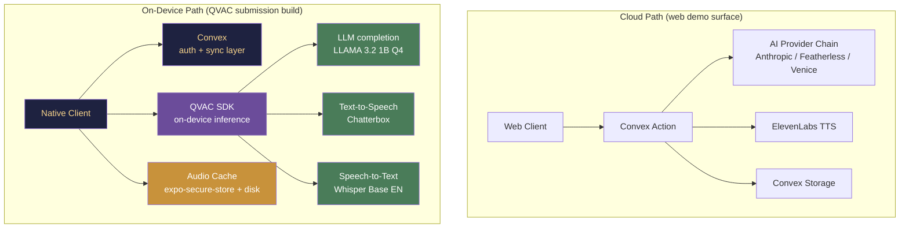

# Future Selves

<p align="center">
  </a>
</p>

> **🏆 QVAC "Unleash Edge AI" Hackathon Submission** — Best Use of QVAC SDK  
> All inference (LLM, TTS, STT) runs **fully on-device** via [QVAC](https://qvac.tether.io).  
> Zero bytes leave your hardware. No cloud keys required.

A voice-driven narrative ritual where your future selves send daily transmissions, and your smallest choices reshape who gets to speak tomorrow.

## Start here

If you just landed in the repo, use this path:

1. Read this file for the project overview
2. Read `apps/default/README.md` for the client app
3. Run the backend with `packages/backend`
4. Run the client with `apps/default`

## Core loop

1. Introduce your current life chapter through short onboarding prompts
2. Submit one word and an optional note for today
3. Receive a personalized transmission from a future self
4. Make a tiny choice that nudges the timeline
5. Unlock new voices as your streak, context, and divergence evolve
6. **The Last Voicemail**: Capture an emotionally charged situation and receive a critique-driven cinematic voicemail from a future you.

## Repository structure

```text
futureselves/
├── .env.example          # Root environment template
├── .githooks/            # Repo-local Git hooks, including secret protection
├── apps/
│   └── default/          # Expo app (iOS, Android, Web)
├── assets/               # Shared visual/media assets used by the app
├── demo/
│   ├── DEMO.md           # Demo script + capture notes
│   └── videos/           # Demo recordings and exported clips
├── packages/
│   └── backend/          # Convex backend and game logic
├── scripts/              # One-off helper/patch utilities
├── AGENTS.md             # Project-specific AI/tooling notes
├── package.json          # Bun workspace + Turbo entrypoint
└── turbo.json            # Task graph
```

## Workspaces

### `apps/default`
The playable client.

- Expo + React Native
- mobile-first, also runs on web through Expo
- UI, onboarding, transmission player, progression screens

See `apps/default/README.md`.

### `packages/backend`
The shared backend.

- Convex schema
- auth setup
- game loop and progression logic
- AI generation and ElevenLabs integration

See `packages/backend/README.md`.

## Getting started

### 1. Install dependencies

```bash
bun install
```

### 2. Create your environment file

Copy the template at the repo root:

```bash
cp .env.example .env
```

Then fill in the Convex and optional provider values.

### 3. Enable the repo-local Git hook

This repo includes a pre-commit hook that helps block accidental secret commits.

```bash
git config core.hooksPath .githooks
```

### 4. Run the backend

```bash
cd packages/backend
bun run dev
```

### 5. Run the app

```bash
cd apps/default
bun run start
```

Or from the root:

```bash
bun run dev
```

## Environment notes

At minimum, local development expects Convex environment values in the root `.env`.

Optional keys unlock the full audio + AI flow:
- `ANTHROPIC_API_KEY`
- `ELEVENLABS_API_KEY`

Without those, the app can still run in a text-first mode for development and testing.

## Demo materials

Everything demo-specific now lives under `demo/`.

- `demo/DEMO.md` — recording plan, sample personas, capture tips
- `demo/videos/` — exported demo artifacts

## Utility scripts

One-off patch utilities live under `scripts/` instead of the repo root so the top level stays readable.

See `scripts/README.md`.

## Architecture


<br/>
✋ **The submission path is the right side.** A judge can put the device in airplane mode and the full ritual loop (check-in → LLM → TTS → playback) runs end to end.

## Tech stack

| Layer | Cloud (vercel.app) | On-Device (submission build) |
|---|---|---|
| **Frontend** | Expo + React Native (web) | Expo + React Native (iOS) |
| **Backend** | Convex | Convex (auth only) |
| **LLM** | Anthropic Claude / Fallback | QVAC `completion` → LLAMA 3.2 1B |
| **TTS** | ElevenLabs | QVAC `textToSpeech` → Chatterbox |
| **STT** | — | QVAC `transcribe` → Whisper Base EN |
| **Agentic** | Melius MCP | Reserved for future on-device |
| **Monorepo** | Bun workspaces + Turbo | Same |
| **Privacy** | Data shipped to 3rd parties | **Zero bytes uploaded** |

> **Privacy thesis:** The product is "your future self knows your deepest choices, and only you have access." On-device inference makes this literally true. The public web demo (`futureselves.vercel.app`) is an honest preview — it uses a hard-coded sample persona and never asks for real personal data. See `docs/privacy-posture.md`.
> Complete QVAC integration plan: `docs/edge-ai-qvac.md`.

## Submission build

Build the on-device app for the QVAC hackathon judging panel:

```bash
# 1. Build the native app with the local provider
cd apps/default
EXPO_PUBLIC_AI_PROVIDER=local npx expo run:ios --configuration Release

# 2. Or build via EAS
npx eas build --profile submission --platform ios

# 3. The `.env.production` at the repo root already sets
#    EXPO_PUBLIC_AI_PROVIDER=local for the submission
```

## Cost comparison

| | Cloud path per transmission | On-device path per transmission |
|---|---|---|
| **LLM inference** | ~$0.0015 (Claude Sonnet) | **$0** |
| **TTS** | ~$0.0003 (ElevenLabs, 30 words) | **$0** |
| **STT** | Not available (no cloud STT used) | **$0** |
| **Network** | ~2–5 MB round-trip | **0 bytes** |
| **Latency** | 3–8 s (API + audio download) | **Instant** (cache hit) / 15–25 s (cold) |
| **Privacy** | Data shipped to Anthropic + ElevenLabs | **Never leaves device** |

After the first cold-start download (~100 MB total for all 3 models), every subsequent transmission costs **zero marginal compute and zero bandwidth**. The privacy gain is the feature.

### What the judges see

1. App launches → model pre-warming starts (LLM + TTS + STT in parallel, shown via progress bar)
2. User completes onboarding → first transmission generated locally
3. **Network-kill proof**: OS-level airplane mode engaged, `fetch()` returns `TypeError` in console, transmission still arrives
4. **Privacy chip**: top-right corner — `bytes uploaded: 0 · inference: on-device · last model: chatterbox · cache hit: yes`
5. **Spoken check-in**: tap the mic → record → Whisper transcribes locally → first word fills the input
6. **The Last Voicemail**: critique-driven cinematic voicemail, fully offline (Melius MCP reserved for future)

## The Last Voicemail

A milestone-gated feature where your future self sends a cinematic voicemail synthesized from your emotional journey.

### How it works

Voicemails are **earned through progression**, not freely available:

| Milestone | Trigger | What you get |
|---|---|---|
| Day 7 streak | 7 consecutive check-ins | 1 free voicemail (text + audio) |
| Day 30 streak | 30 consecutive check-ins | 1 premium voicemail (full cinematic) |
| Day 90 streak | 90 consecutive check-ins | 3 premium voicemails |
| Arc completion | Narrative thread resolved | 1 premium voicemail |
| Weekly reflection | After weekly summary | 1 free voicemail |

### Free vs. Premium

- **Free tier**: Voicemails generated from your ritual data (check-ins, choices, emotional arc) using the built-in AI pipeline. Text + audio only.
- **Premium tier**: Full cinematic experience — multi-agent orchestration via Melius MCP, atmospheric imagery, video loops, and the critique-driven refinement loop. Premium users can also provide custom situations.

### Technical architecture

- **Free path**: `voicemail.native.ts` → `ai.ts` (direct AI calls) → ElevenLabs
- **Premium path**: `voicemail.ts` → `melius.ts` (Melius MCP) → ElevenLabs + image + video

## Notes

- If diagnostics look noisy on a fresh clone, run `bun install` first.
- Some hidden directories in the root are tool-specific local metadata; the important project-owned entry points are the directories listed above.
- The current focus is hardening the core ritual for real users before expanding feature surface area.
